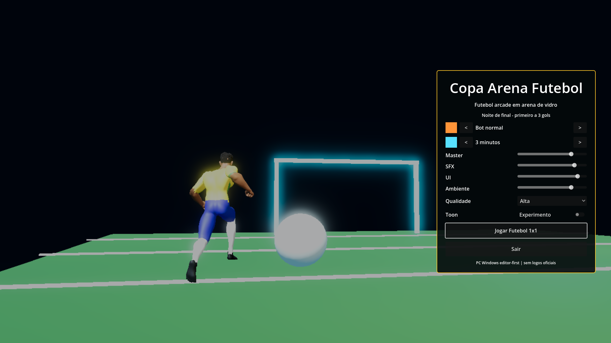
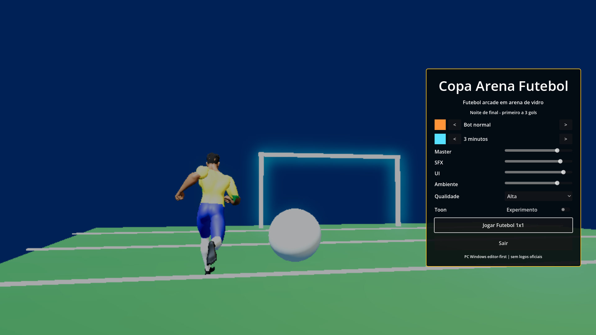
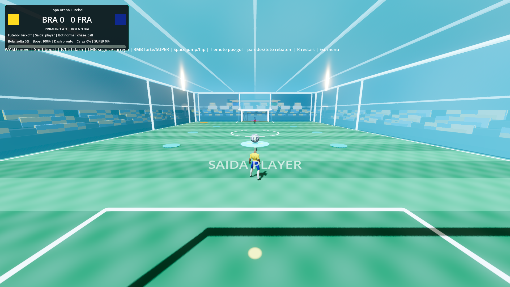
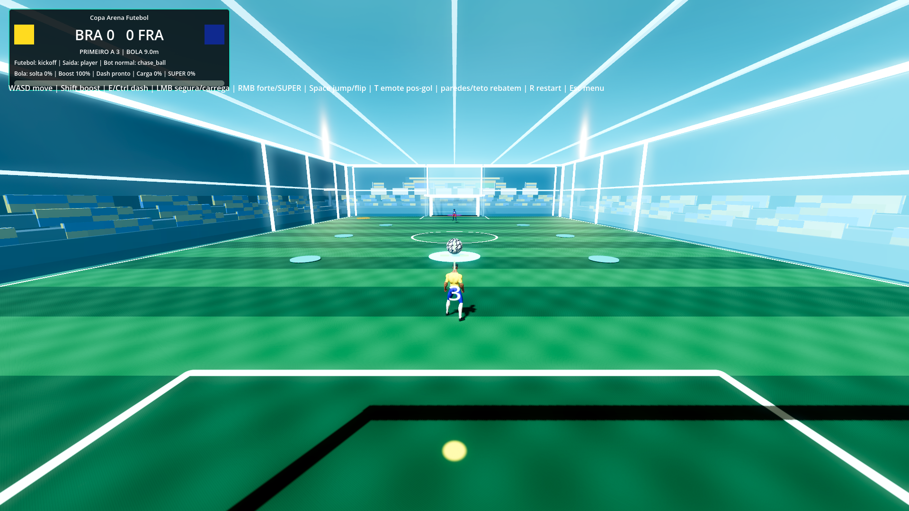
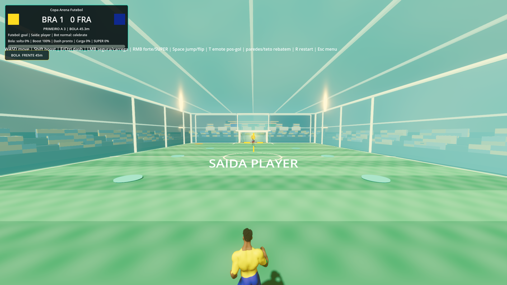
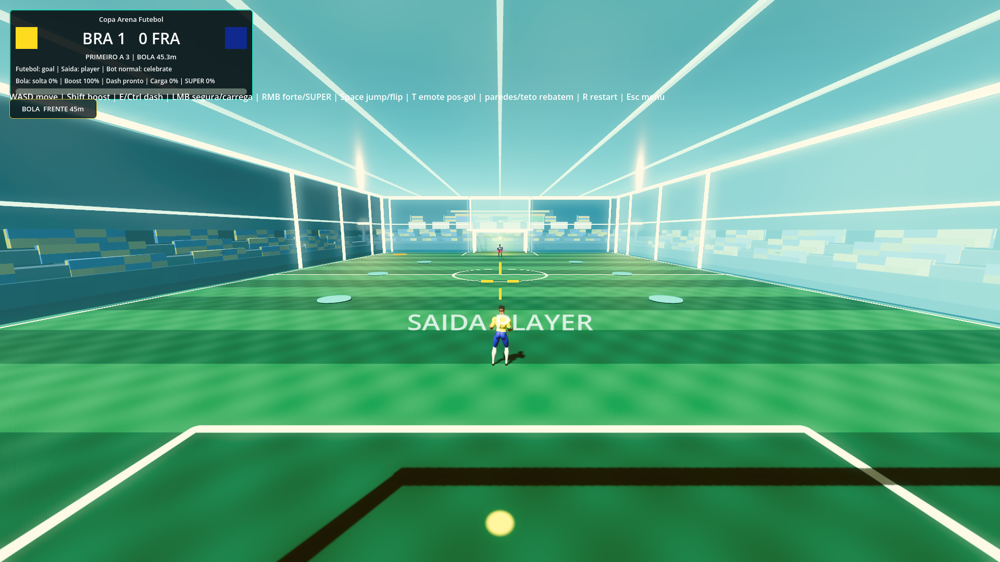
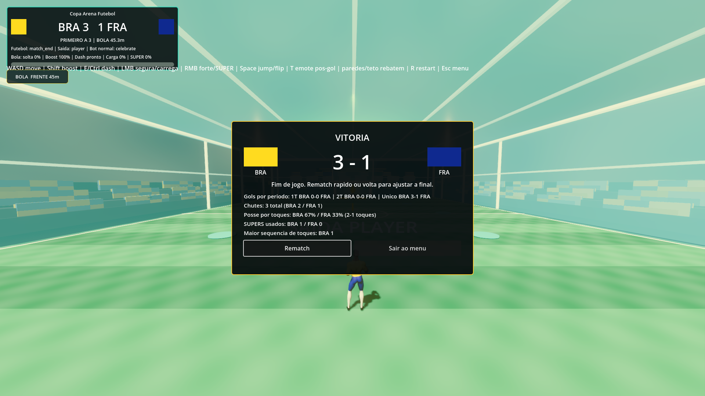
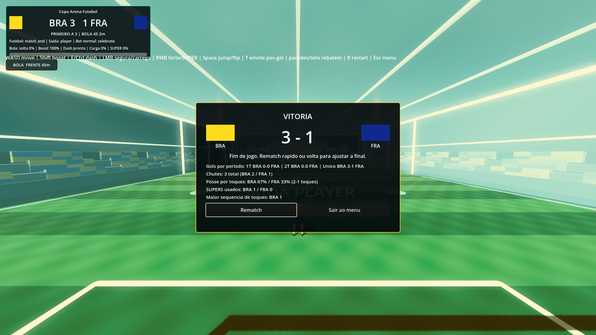
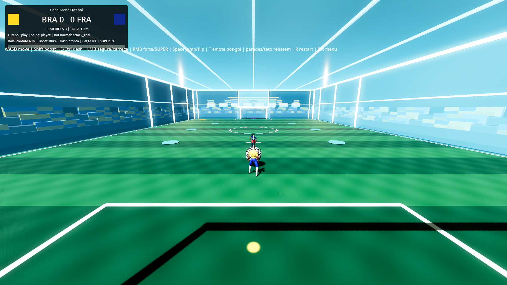

# Track 04E - Web Export Spike & Render Profile V1

- Date: `2026-06-11`
- Branch: `codex/jogodacopa/track04e-web-spike-v1`
- Worktree: `D:\Estudio-worktrees\jogodacopa-track04e`
- Build target: Web single-threaded, Compatibility renderer, no SharedArrayBuffer, no COOP/COEP headers.
- Verdict: ACCEPTABLE FOR REVIEW. The game boots and runs in local Chrome at 1080p with a visual identity recognizably matching desktop, but final parity is a Fabio/Claude visual decision before merge.

## Commands

```powershell
D:\Estudio\.local-tools\godot\4.6.2\Godot_v4.6.2-stable_win64_console.exe --headless --editor --quit --path .
D:\Estudio\.local-tools\godot\4.6.2\Godot_v4.6.2-stable_win64_console.exe --headless --path . -s res://tools/validate.gd
D:\Estudio\.local-tools\godot\4.6.2\Godot_v4.6.2-stable_win64_console.exe --headless --path . --export-release "Web" "builds/web/index.html"
D:\Estudio\.local-tools\godot\4.6.2\Godot_v4.6.2-stable_win64_console.exe --path . -s res://tools/performance_sample.gd --label=track04e-web-spike-v1
```

Chrome smoke served `builds/web/` over local HTTP and opened:

- `/index.html`
- `/index.html?jdc_capture=kickoff`
- `/index.html?jdc_capture=goal`
- `/index.html?jdc_capture=result`
- `/index.html?jdc_capture=play`

## Evidence

| Scene | Desktop Forward+ | Web Compatibility |
|---|---|---|
| Menu hero |  |  |
| Kickoff |  |  |
| Goal |  |  |
| Result |  |  |

Extra Web performance frame:



## Export Contract

- Web preset output: `builds/web/index.html`.
- `variant/thread_support=false`.
- `variant/extensions_support=false`.
- `progressive_web_app/ensure_cross_origin_isolation_headers=false`.
- Generated HTML contains `GODOT_THREADS_ENABLED = false`.
- Chrome runtime: `crossOriginIsolated=false`, `SharedArrayBuffer=false`.
- Local smoke: canvas `1920x1080`, no page errors, no unexpected console errors.

## Renderer Inventory

| Item | Desktop Forward+ | Web Compatibility | Verdict |
|---|---|---|---|
| Glow/bloom | Stronger glow around glass frames, stadium lights and emissive materials. | Glow reads flatter/weaker; `RenderProfile` raises emissive multipliers for Web. | PASS with tuned fallback; Fabio visual review required. |
| SSAO | Enabled in desktop profile. | Disabled by profile; fake AO intent handled via ambient/fog/shadow tuning. | EXPECTED FALLBACK. |
| Fog | ACES/night fog gives deeper stadium volume. | Compatibility fog is lighter/brighter to avoid muddy Web image. | PASS, recognizably same arena. |
| Sky | Desktop night sky has more contrast/depth. | Web sky is flatter/brighter, still preserves Copa arena silhouette. | PASS with visual difference. |
| Pitch shader | Field stripes/markings render. | Field stripes/markings render. | PASS. |
| Nets shader | Grid nets and goal frames render. | Grid nets and goal frames render, glow less pronounced. | PASS. |
| Crowd/stands shader | Crowd blocks, team colors and excitement bands render. | Crowd blocks and colors render with flatter lighting. | PASS. |
| Ball shader | Panel shader, trail/fireball contract intact. | Panel shader renders; Web emission scale applied. | PASS. |
| Uniform regions | PBR texture/tint and regional kit colors preserved. | Regional kit colors render; Web emission fallback does not affect gameplay. | PASS. |
| Fireball/VFX | Desktop VFX brighter. | Web particle amount is reduced and emission scaled for readability. | PASS with performance fallback. |
| SubViewports | Stadium scoreboards and menu preview use full desktop sizes. | Web profile uses lower SubViewport sizes for scoreboards and menu preview. | PASS; no blank preview observed. |
| Particles | Full desktop particle amounts. | Web profile reduces transient particle amounts. | PASS; visible and within budget. |
| Audio autoplay | Desktop starts through normal Godot audio flow. | Browser requires first user interaction; `RenderProfile` documents the policy and Chrome smoke performs a click. | EXPECTED BROWSER POLICY. |
| `user://` save | Desktop uses local user data. | Web contract is `user://` via IndexedDB. No manual save loop was exercised in this spike. | CONTRACT RECORDED; persistence UI not yet a gameplay feature. |
| CCD da bola | Existing `continuous_cd` coverage remains. | Same gameplay code/path; Web smoke produced no runtime errors. | PASS. |
| Performance | Desktop Forward+ real window: average `738.1fps`, min `451.3fps`, `0/360` below 60. | Chrome rAF sample: average `102.0fps`, p95 `8.1ms`; one isolated max `552.3ms` during headless sampling, boot/captures stayed responsive. | PASS for local 1080p smoke; remeasure interactively before publication. |

## Validation Results

- Full validation: PASS, 85 tests, 1250 asserts.
- Source integrity: PASS, 33 `.gd/.gdshader` files outside `addons/`.
- Web export: PASS, exit code `0`.
- Chrome smoke: PASS, no page errors and no unexpected console errors.
- Desktop performance sample: PASS, 0/360 frames below 60.

## Known Noise

- Godot/GUT UID text-path warnings still appear during import/export/validation and are existing accepted noise when tests pass.
- The Web runtime intentionally logs known `RenderProfile` warnings once for Compatibility fallbacks. Silent fallback is not allowed; unknown or invalid runtime divergence must emit `push_error`.

## Handoff

Stop on branch for mandatory Claude pre-merge review and Fabio visual parity decision. This changes platform/render behavior, so it must not be merged without review.
